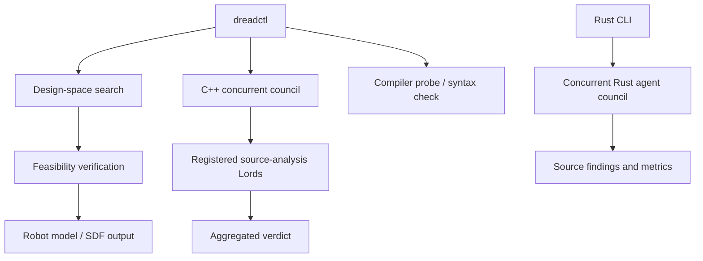

# Dread Lords v3 — C++ Engineering & Robotics Discovery Engine

> A C++23 design-space discovery and source-verification toolkit, with a
> companion Rust agent council.

[](https://github.com/hardbassschool/dread-kings/actions/workflows/cpp.yml)
[](https://github.com/hardbassschool/dread-kings/actions/workflows/rust.yml)
[](LICENSE)

This is a functional C++23 baseline for Dread Lords. It does not claim that generated candidates are physically validated inventions; it performs computational design-space search, evaluates declared constraints, verifies the computational contract, and emits a robot-model artifact.

## Quick start

Prerequisites: CMake 3.20+ and a C++23-capable compiler. From the repository
root:

```bash
cmake -S . -B build -DCMAKE_BUILD_TYPE=Release
cmake --build build --parallel
ctest --test-dir build --output-on-failure
./build/dreadctl
```

To run the Rust source-analysis companion, install stable Rust and run from
`rust-agents/`:

```bash
cd rust-agents
cargo test
cargo run -- ../examples/dreadctl.cpp
```

See [Contributing](CONTRIBUTING.md) for formatting and lint checks.

## Architecture

- `src/discovery/` and `include/dreadlords/discovery/`: design vectors,
  candidate generation, and random search.
- `src/robotics/` and `include/dreadlords/robotics/`: robot model and SDF
  generation.
- `src/verification/` and `include/dreadlords/verification/`: feasibility
  contract and source-level concurrency check.
- `src/toolchain/` and `include/dreadlords/toolchain/`: compiler probing and
  invocation; `include/dreadlords/compiler/` and `src/toolchain/` also provide
  surgical source rewrite utilities.
- `src/core/` and `include/dreadlords/core/`: shared Lord, council,
  problem-context, and verdict contracts.
- `rust-agents/`: a Rust library and CLI for concurrent source-analysis agents.
- `knowledge/cppreference/`: reference-layer policy and entry points.



## Council pipeline

The first Dread Kings 2.0 slice is available through `core::create_dread_council()`.
Register `core::DreadLord` implementations, then submit a `core::ProblemContext`:

```cpp
auto council = dread::core::create_dread_council();
council->register_lord(
	std::make_unique<dread::concurrency::DreadConcurrencyLord>());

dread::core::ProblemContext problem{
	.context_id = "candidate.cpp",
	.raw_source_code = source,
	.requested_standard = dread::core::CppStandard::Cpp23};
const auto verdict = council->evaluate_all(problem);
```

Registered Lords run concurrently and their violations are aggregated. The
concurrency Lord flags `memory_order_relaxed` stores when threaded source is
present and reports a remediation plus ISO clause reference. This is a
source-level heuristic, not a replacement for ThreadSanitizer or formal model
checking. `dreadctl verify <file>` also performs an optional `clang++` syntax
check; set `DREAD_COMPILER` to a Clang or GCC executable to select another
compiler. Missing external compilers are reported but do not hide Lord results.

## Rust agent council

`rust-agents/` is a companion Rust crate that analyzes source files using
concurrent agents. It demonstrates trait objects, iterator pipelines, `Box` to
`Arc` ownership, shared `Arc<str>` context, mutex-protected metrics, Tokio
blocking tasks, completion channels, and typed agent errors. Run it from the
crate directory:

```bash
cargo test
cargo run -- ../examples/dreadctl.cpp
```

Domain failures use `thiserror`; the command-line boundary uses `anyhow` to add
file context. `Rc<RefCell<T>>` is deliberately not used in the concurrent
council: it is for single-threaded shared mutation, while these `Send + Sync`
agents run across worker threads. The crate tests cover source findings,
duplicate registration, concurrent completion, metrics, and aggregated errors.

## Surgical rewrites

`compiler::DreadClangRewriter` applies line/column-scoped token directives and
returns the original source, modified source, replacement count, and unified
diff without writing the file. The current backend is dependency-free and
preserves source bytes; installing LLVM/Clang libTooling is required before
replacing it with a true AST traversal backend.

## Next production integrations

1. Replace the analytical evaluator with a Gazebo/MuJoCo adapter.
2. Add ROS 2 transport/control nodes.
3. Add AST-aware C++ generation/refactoring.
4. Add compiler diagnostic parsing and repair loops.
5. Add multi-objective/Pareto optimization and experiment provenance.
6. Add hardware-in-the-loop gates before any physical deployment.

## Project policies

- [Contributing](CONTRIBUTING.md)
- [MIT License](LICENSE)
